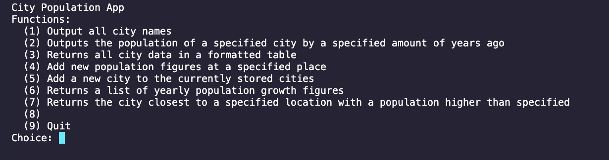

# Haskell-Population-App
Repository for my Haskell Population Application Coursework for M21274-2022/23-SMJAN MATHFUN/Functional-Programming

Overview of Project
This project required me to design & build a Functional CLI to maintain a simple back-end datastore of cities & populations, supports table generation, sorting, distance calculations, and updates via an interactive terminal interface.


Back-end & Front-end code
The code for this project can be found in ```./Project/UP2006885.hs``` in its entirety or in ```./ProjectFiles/``` for the code separated into multiple file modules, it runs through the console.

## Run
> ghci UP2006885.hs

> main

## Image of CLI

